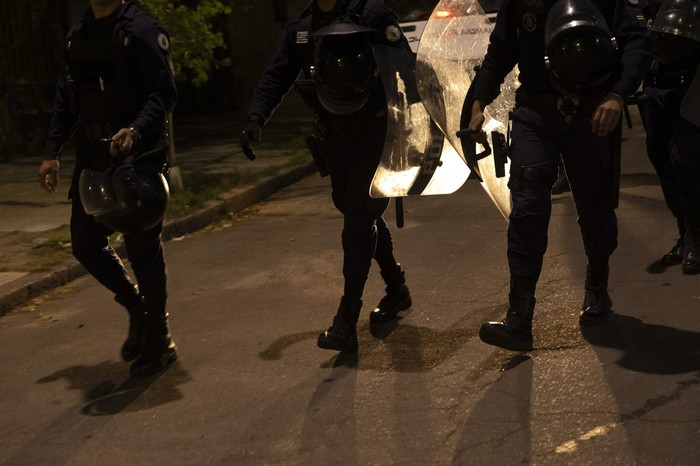

```{r setup, include=FALSE}
knitr::opts_chunk$set(echo = FALSE)

library(echarts4r)
library(dplyr)
library(MetBrewer)

e_common(font_family = "Ubuntu", theme = NULL)
```


# Síntesis

El próximo 27 de octubre los habilitados a votar no sólo elegirán la fórmula
presidencial, sino que también votarán si quieren habilitar o no los allanamientos
nocturnos, plebiscito impulsado por el senador del Partido Nacional Carlos Camy.
Esta iniciativa busca modificar el artículo 11 de la Constitución, que prohíbe este
tipo de operativos en hogares durante la noche.


```{r fig.align='center', out.width="90%", fig.cap="Operativo policial. Foto: Rodrigo Viera Amaral"}

```

## Nivel de información

**¿Cuál es tu nivel de información en relación al Plebiscito para habilitar los allanamientos nocturnos que se votará en las próximas elecciones nacionales?**

22% de las personas consultadas se considera "muy informado/a" en relación a este plebiscito; 51% dice estar "algo informado/a" y 19% "nada informado/a". El restante 8% no sabe o no contesta.

```{r}

tabla <- data.frame(x = c("NS/NC", "Nada informado/a", "Algo informado/a", "Muy informado/a"),
                    perc = c(8, 19, 51, 22))
tabla <- tabla %>% mutate(Total = paste0(perc, "%"))

tabla %>% 
 e_charts(x)  %>% 
  e_bar(perc) %>% 
  e_legend(show = FALSE) %>%
  e_flip_coords() %>% 
  e_toolbox_feature(feature = "saveAsImage", title = "Descargar") %>%
  #e_labels(position = "right", color = "#515656",  formatter = "{@value} %") %>%
  e_grid(left = "30%") %>%
  e_grid(right = "1%") %>%
  e_grid(width = "100%") %>%
  e_show_loading() %>%
  e_tooltip(formatter =e_tooltip_item_formatter("percent") ) %>% 
  e_color(c("#bf3626", "#f9c53b", "#165d43"))


```

